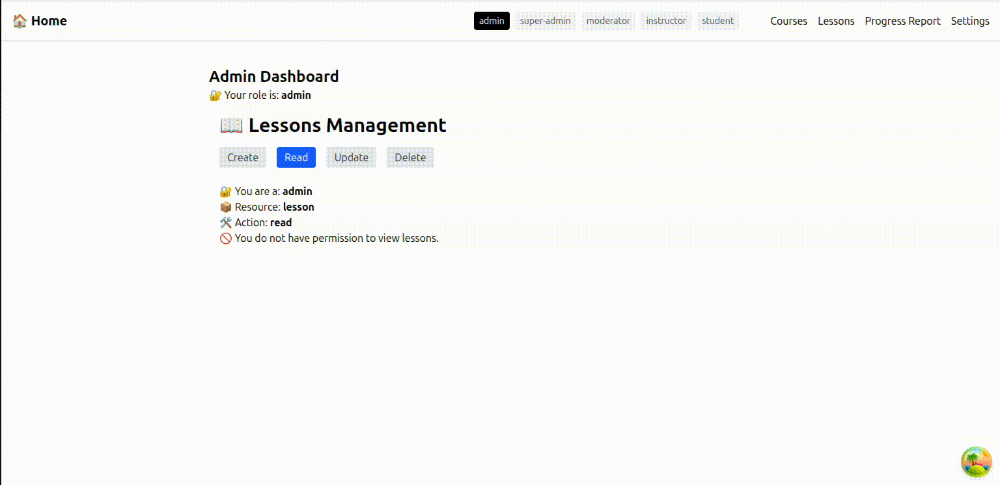

# Access Control Layer (ACL) Integration for React Apps in a Monorepo

## 🔍 Overview

In large-scale projects, managing access control across multiple roles and features can quickly become complex and error-prone. This research-driven ACL (Access Control Layer) implementation was introduced to solve permission-related issues effectively and provide a scalable, centralized system for controlling feature-level access based on user roles.




## 🎯 Why This Solution?

Traditional access control implementations are often scattered, hardcoded, and tightly coupled with component logic. By introducing a clean, reusable ACL system:

- ✅ We avoid permission-checking duplication across the app.
- ✅ We make the UI reactive to access rights.
- ✅ We provide a clear definition of what each role can or cannot do.
- ✅ We improve scalability and maintainability for growing teams and applications.

## 🧩 Core Packages Used

- [`@casl/ability`](https://github.com/stalniy/casl): Provides a powerful and flexible permission definition system.
- [`@tanstack/react-router`](https://tanstack.com/router): Modern routing library used to build the navigation structure.

## 🛠️ Tools & Tech Stack

- React
- TypeScript
- TailwindCSS
- CASL
- TanStack Router
- Vite (or Next.js / React Scripts as adaptable)

## 🏗️ What Was Implemented

### 1. **Role-Based Ability Config**

We created a central `aclConfig` which maps each role to their allowed actions per subject (feature). For example:

```ts
export const aclConfig = {
  admin: {
    courses: ['create', 'read', 'update', 'delete'],
    lessons: ['read', 'update'],
    ...
  },
  user: {
    courses: ['read'],
  },
};
```

### 2. **Ability Definition Function**

We define `defineAbilitiesFor(role)` to dynamically return an `Ability` instance from `@casl/ability` based on the role’s rules.

### 3. **React Context Providers**

Introduced `AclProvider` and `RoleProvider` to provide:

- ✅ Central access to the current role's ability
- ✅ Ability checks via custom hooks

### 4. **Custom Hooks**

- `useCan(subject, action)` – Checks if current role can perform action on subject
- `useRole()` – Gets the current user's role from context

### 5. **Can JSX Wrapper**

```tsx
<Can I="read" a="course">
  <CourseList />
</Can>
```

This declarative component hides content from unauthorized roles.

### 6. **Folder-Based Route Layouts per Role**

Using TanStack Router’s `__root.tsx` layout convention, we dynamically wrap role-specific routes under context providers (`admin/__root.tsx`, `super-admin/__root.tsx`, etc.)

### 7. **UI Components Per Feature**

Each feature (e.g. courses) has CRUD-specific components:

```ts
CourseFormCreate
CourseFormRead
CourseFormUpdate
CourseFormDelete
```

Switchable with tabs or route views.

## 👥 Roles Supported

- `admin`
- `super-admin`
- `editor`
- `user`
- `guest`

## 📦 Features Supported

- `courses`
- `lessons`
- `progress`
- `report`
- `settings`

Each feature has specific CRUD capabilities managed via `aclConfig`.

## 📁 Project Structure

```
/packages
  /acl                → ACL system (contexts, hooks, config)
  /features           → Each feature’s UI components
/app
  /admin              → Super admin/ Admin routes and layout
  /moderator        → Moderator/ Instructor routes and layout
  /student        → Student routes and layout
```

## ✅ Benefits

- Centralized permissions control
- Clean, declarative access checks
- Reusable across any route or component
- Easy to maintain and extend for future roles/features

---

## 🚀 Getting Started

1. Install dependencies:


2. Wrap root layouts with appropriate providers:

```tsx
<AclProvider role="admin">
    {children}
</AclProvider>
```

3. Use the `Can` component or `useCan` in your features.

---


**Made with ☕ and 🔥 by Zenku**
